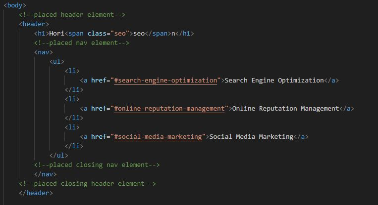

# Challenge #1

## Description
This site was created to teach companies how to optimize their company for marketing online. Codebase changed to accessibility standards for search engines.

https://b3hold23.github.io/Horiseon-dev/

The code change done made small changes to the site for better search optimization. I have consolidatd the stylesheet to have less room and to better fit the elements in the HTML file. I have also ordered the stylesheet according to the  order of elements found on the HTML.

## Usage

Below are screenshots to provide a look at what was consolidated:

Below I am showing the consolidation done on the CSS sheet:

I have also noted on the HTML on the change that was made.

## Credits

- tutorial video I used for README help: https://www.youtube.com/watch?v=E6NO0rgFub4&t=133s

- Template used: https://coding-boot-camp.github.io/full-stack/github/professional-readme-guide